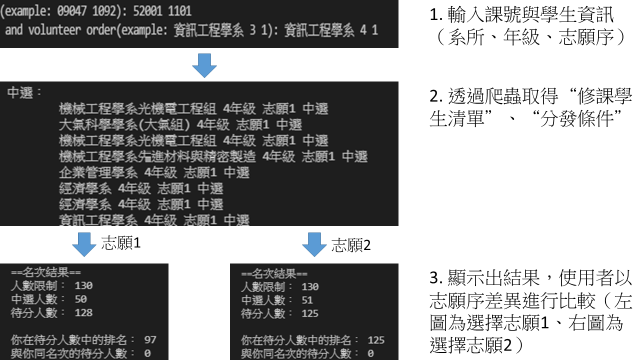
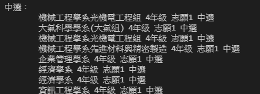
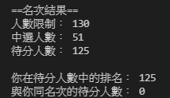

# Elective Coruses
<div align="center">
  <a href="https://cis.ncu.edu.tw/Course/main/news/announce">
    
  </a>
</div>
A web crawler implementation system for National Central University (NCU) students which will fetch the student info from the selected course then compare the list with student's volunteer order automatically. Which is a great tool for students to decide how high the order should be in order to join the class.  
<div align="center">
    
</div>

### Requirement

The system is built in python 3 so user must first install python 3.x and following libraries before running the system.

  * pandas
  * re

## Input Section Guide
First, user may need to write down the course's id (6 numbers) and semester (ROC era + first or second semester, for example 1101).  
```
input course's id and semester(example: 09047 1092): 52001 1101
```
Then, input user's department, grade and most importantly the volunteer order number.
```
input user's department, grade and volunteer order(example: 資訊工程學系 3 1): 資訊工程學系 4 2
```
  
## Output Section Guide
After complete the steps above, the system will fetch the data from [NCU Schedule Planning System](https://cis.ncu.edu.tw/Course/main/news/announce). User can see the result then compare whether the volunteer order is high enough and the chance to be selected. The following images are the quick look at the system returned info and comparison result. 
<!--
*** Output explanation:
*** "中選:": shows the students in list are selected  
*** "待分發:": shows the students in list are in queue  
*** "無法加選:": shows by analysing list order, the students in list cannot be selected by system
*** "順位 num1, 第 num2 志願": shows students will be num1 th order when their volunteer is num2  
*** "==選課結果==": shows the course studends limit, number of selected and number in queue  
-->
<!--  
待分發： 順位 1 , 第 1 志願  
        資訊工程學系 4年級 志願1 待分  
        資訊工程學系 4年級 志願1 待分  
        資訊工程學系 4年級 志願1 待分  
        資訊工程學系 4年級 志願1 待分  
        資訊工程學系 4年級 志願1 待分  
        資訊工程學系 4年級 志願1 待分  
        資訊工程學系 4年級 志願1 待分  
        資訊工程學系 4年級 志願1 待分  
        資訊工程學系 3年級 志願1 待分  
        資訊工程學系 3年級 志願1 待分  
        資訊工程學系 3年級 志願1 待分  
        資訊工程學系 3年級 志願1 待分  
        資訊工程學系 3年級 志願1 待分  
        資訊工程學系 3年級 志願1 待分  
        資訊工程學系 3年級 志願1 待分  
        資訊工程學系 3年級 志願1 待分  
        資訊工程學系 3年級 志願1 待分  
        資訊工程學系 3年級 志願1 待分  
        資訊工程學系 3年級 志願1 待分  
        資訊工程學系 3年級 志願1 待分  
        資訊工程學系 3年級 志願1 待分  
        資訊工程學系 3年級 志願1 待分  
        資訊工程學系 3年級 志願1 待分  
        資訊工程學系 3年級 志願1 待分  
        資訊工程學系 3年級 志願1 待分  
        資訊工程學系 3年級 志願1 待分  
        資訊工程學系 3年級 志願1 待分  
待分發： 順位 2 , 第 1 志願  
        資訊電機學院學士班 4年級 志願1 待分  
        資訊電機學院學士班 4年級 志願1 待分  
        資訊電機學院學士班 3年級 志願1 待分  
        資訊電機學院學士班 3年級 志願1 待分  
        資訊電機學院學士班 3年級 志願1 待分  
無法加選：
        資訊管理學系 4年級 志願1 待分  
        數學系 4年級 志願1 待分  
        數學系 4年級 志願1 待分  
        數學系 4年級 志願1 待分  
        經濟學系 4年級 志願1 待分  
        電機工程學系 4年級 志願1 待分  
        工學院學士班 3年級 志願1 待分  
        大氣科學學系(大氣組) 3年級 志願1 待分    
  
==名次結果==  
人數限制： 40  
中選人數： 0  
待分人數： 40  
-->
<div align="center">
    
    
</div>
